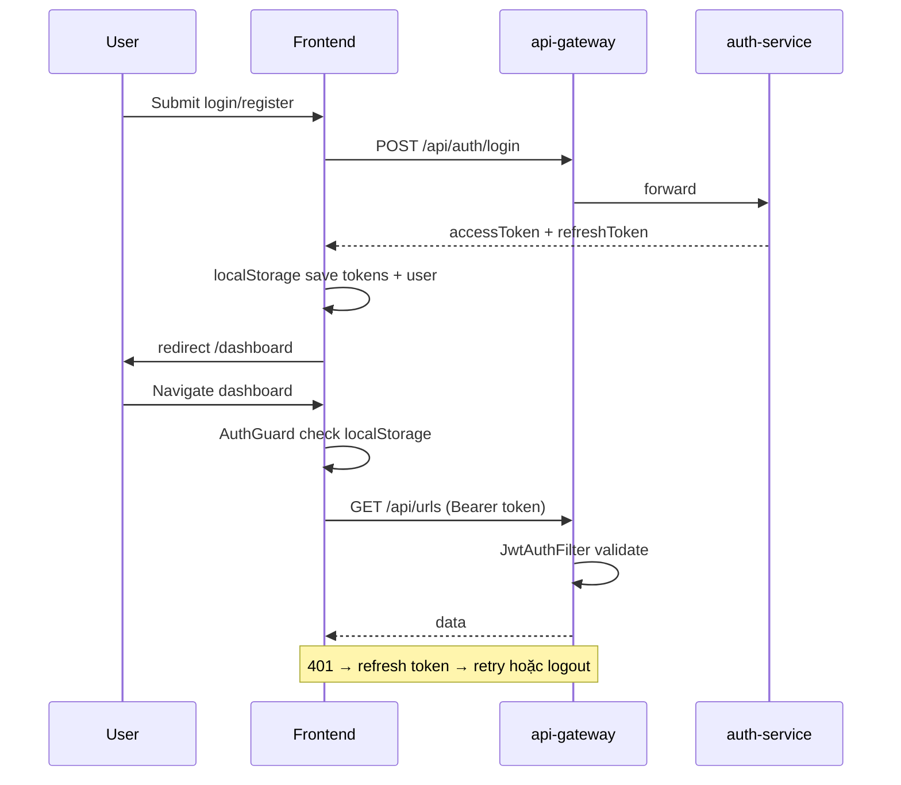
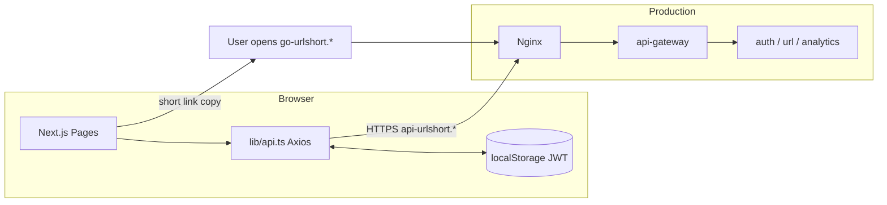

# Kiến trúc & Cấu trúc Dự án — URL Shortener Frontend

Tài liệu mô tả cấu trúc **url-shortener-fe**, từng công nghệ UI/API, và vai trò trong hệ thống full-stack.

**Backend & hạ tầng:** [url-shortener-be/ARCHITECTURE.md](https://github.com/toannguyenit/url-shortener-be/blob/main/ARCHITECTURE.md)

**Deploy:** [DEPLOY.md](./DEPLOY.md) | **Chạy local:** [STARTUP.md](./STARTUP.md)

---

## Mục lục

1. [Vai trò trong hệ thống](#1-vai-trò-trong-hệ-thống)
2. [Cấu trúc thư mục](#2-cấu-trúc-thư-mục)
3. [Routing & pages](#3-routing--pages)
4. [Luồng xác thực (JWT)](#4-luồng-xác-thực-jwt)
5. [API client](#5-api-client)
6. [Components & UI](#6-components--ui)
7. [Công nghệ & mục đích sử dụng](#7-công-nghệ--mục-đích-sử-dụng)
8. [Docker & build production](#8-docker--build-production)
9. [CI/CD](#9-cicd)
10. [Sơ đồ luồng dữ liệu](#10-sơ-đồ-luồng-dữ-liệu)

---

## 1. Vai trò trong hệ thống

Frontend là **dashboard quản trị** cho URL Shortener:

| Chức năng | Mô tả |
|-----------|-------|
| Auth | Đăng ký, đăng nhập, lưu JWT |
| Shorten | Tạo link — URL dài → mã ngắn, custom alias, expiry |
| Links | Bảng quản lý — sửa, xóa, bật/tắt |
| QR | Hiển thị QR code (API backend trả PNG hoặc render client) |
| Analytics | Biểu đồ click, geo distribution |

**Không xử lý redirect** — short link mở qua subdomain `go-urlshort.*` → `redirect-service` backend.

### URL production

| | URL |
|---|-----|
| App | https://urlshort.toannguyenit.cloud |
| API | https://api-urlshort.toannguyenit.cloud |
| Short link | https://go-urlshort.toannguyenit.cloud/{code} |

---

## 2. Cấu trúc thư mục

```
url-shortener-fe/
├── src/
│   ├── app/                    # Next.js App Router
│   │   ├── layout.tsx          # Root layout, fonts, Toaster
│   │   ├── page.tsx            # / → redirect login hoặc dashboard
│   │   ├── globals.css         # Tailwind v4 + dark mode CSS
│   │   ├── (auth)/             # Route group — không ảnh hưởng URL
│   │   │   ├── login/page.tsx
│   │   │   └── register/page.tsx
│   │   └── (dashboard)/        # Route group — có AuthGuard
│   │       ├── layout.tsx
│   │       ├── dashboard/page.tsx
│   │       ├── shorten/page.tsx
│   │       └── links/
│   │           ├── page.tsx
│   │           └── [id]/page.tsx
│   ├── components/
│   │   ├── auth-guard.tsx      # Bảo vệ route dashboard
│   │   ├── sidebar.tsx         # Navigation + logout
│   │   └── ui/                 # shadcn-style primitives
│   ├── lib/
│   │   ├── api.ts              # Axios + JWT interceptors
│   │   └── utils.ts            # cn() helper
│   └── types/
│       └── index.ts            # TypeScript interfaces
├── public/                     # Static assets
├── Dockerfile                  # Production multi-stage build
├── next.config.ts              # output: standalone
├── package.json
└── .github/workflows/deploy.yml
```

---

## 3. Routing & pages

### App Router (Next.js 16)

| URL | File | Mô tả |
|-----|------|-------|
| `/` | `app/page.tsx` | Client redirect: có token → `/dashboard`, không → `/login` |
| `/login` | `(auth)/login/page.tsx` | Form đăng nhập |
| `/register` | `(auth)/register/page.tsx` | Form đăng ký |
| `/dashboard` | `(dashboard)/dashboard/page.tsx` | Thống kê + biểu đồ |
| `/shorten` | `(dashboard)/shorten/page.tsx` | Tạo link mới |
| `/links` | `(dashboard)/links/page.tsx` | Danh sách link |
| `/links/[id]` | `(dashboard)/links/[id]/page.tsx` | Analytics từng link |

### Layout hierarchy

```
layout.tsx (root)
├── (auth)/login, register     — không có sidebar
└── (dashboard)/layout.tsx     — AuthGuard + Sidebar
    └── dashboard, shorten, links/*
```

**Không có `middleware.ts`** — auth hoàn toàn phía client (`localStorage`).

---

## 4. Luồng xác thực (JWT)



### Lưu trữ client

| Key | Nội dung |
|-----|----------|
| `accessToken` | JWT ngắn hạn |
| `refreshToken` | JWT đổi access mới |
| `user` | JSON `{ userId, email, name }` |

### AuthGuard (`components/auth-guard.tsx`)

Kiểm tra `accessToken` + `user` trong `localStorage`. Thiếu → `router.replace('/login')`.

> **Lưu ý bảo mật:** Không gọi `authApi.me()` khi load app — chỉ kiểm tra token tồn tại. Token hết hạn được xử lý bởi Axios interceptor.

---

## 5. API client

**File:** `src/lib/api.ts`

### Cấu hình

```typescript
const API_URL = process.env.NEXT_PUBLIC_API_URL || "http://localhost:8080";
export const api = axios.create({ baseURL: API_URL });
```

### Request interceptor

Tự gắn `Authorization: Bearer <accessToken>` mọi request.

### Response interceptor — refresh token

1. Response `401` → thử `POST /api/auth/refresh`
2. Thành công → lưu token mới, retry request gốc
3. Thất bại → `clearTokens()` → redirect `/login`
4. Hàng đợi request khi đang refresh (tránh race condition)

### API modules

| Module | Endpoints |
|--------|-----------|
| `authApi` | register, login, me |
| `urlsApi` | CRUD `/api/urls`, `qrUrl()` helper |
| `analyticsApi` | dashboard, per-url, geo |

---

## 6. Components & UI

### `sidebar.tsx`

- Nav: Dashboard, Shorten, Links
- Hiển thị user email
- Logout → `clearTokens()` + `/login`
- Export `StatCard` dùng trên dashboard

### `ui/` — shadcn/ui pattern

| Component | Radix / lib | Dùng cho |
|-----------|-------------|----------|
| `button.tsx` | Slot + CVA | Actions |
| `card.tsx` | — | Layout form, stats |
| `dialog.tsx` | Radix Dialog | QR modal, confirm delete |
| `input.tsx`, `label.tsx` | Radix Label | Forms |
| `badge.tsx` | — | Active/Inactive status |

### Icons

`lucide-react` — Link2, BarChart, Trash, Copy, ...

---

## 7. Công nghệ & mục đích sử dụng

### 7.1 Next.js 16 (App Router)

| Dùng gì | Mục đích |
|---------|----------|
| App Router | File-based routing, route groups `(auth)`, `(dashboard)` |
| `"use client"` | Pages tương tác — form, charts, auth |
| `output: "standalone"` | Docker image nhỏ — chạy `node server.js` |
| `next/font` | Geist Sans/Mono — không layout shift |

**Không dùng:** Server Components cho data fetching — toàn bộ gọi API client-side qua Axios.

### 7.2 React 19

Hooks: `useState`, `useEffect`, `useRouter`, `useForm` (via react-hook-form).

### 7.3 TypeScript 5

Type safety cho API response — `src/types/index.ts`:

- `AuthResponse`, `UrlItem`, `DashboardData`, `UrlAnalytics`, ...

### 7.4 Tailwind CSS v4

| Dùng gì | Mục đích |
|---------|----------|
| `@import "tailwindcss"` | CSS-first config v4 |
| `dark:` variants | Dark mode |
| `prefers-color-scheme` | Auto dark trong `globals.css` |
| `cn()` utility | Merge class names (`clsx` + `tailwind-merge`) |

### 7.5 Forms — react-hook-form + Zod

| Dùng gì | Mục đích |
|---------|----------|
| `useForm` | Quản lý state form |
| `zodResolver` | Validate schema |
| Zod 4 | Email format, password min 6, alias rules |

**Pages:** login, register, shorten, edit link.

### 7.6 Axios

| Dùng gì | Mục đích |
|---------|----------|
| Instance + interceptors | JWT attach + auto refresh |
| Error handling | Toast message theo status (409 email exists, network error) |

### 7.7 Recharts 3

| Dùng gì | Mục đích |
|---------|----------|
| `AreaChart` | Dashboard — clicks theo thời gian |
| `BarChart` | Link detail — clicks theo ngày |
| Responsive container | Mobile-friendly charts |

### 7.8 Sonner

Toast notifications — success/error sau API calls.

### 7.9 qrcode.react

`QRCodeSVG` — render QR client-side (backup/complement cho API QR backend).

### 7.10 Dependencies chưa dùng trong `src/`

| Package | Ghi chú |
|---------|---------|
| `next-themes` | Dark mode dùng CSS thay vì theme provider |
| `@radix-ui/react-tabs` | Có thể mở rộng UI sau |
| `@radix-ui/react-dropdown-menu` | Có thể mở rộng UI sau |

---

## 8. Docker & build production

### Dockerfile (3 stage)

| Stage | Mục đích |
|-------|----------|
| `deps` | `npm ci` |
| `build` | `npm run build` + **build-args** |
| `runner` | `node server.js` — user `nextjs` non-root |

### Build-args (bắt buộc production)

```dockerfile
ARG NEXT_PUBLIC_API_URL=https://api-urlshort.toannguyenit.cloud
ARG NEXT_PUBLIC_SHORT_URL_BASE=https://go-urlshort.toannguyenit.cloud
```

> **Critical:** Biến `NEXT_PUBLIC_*` được **nhúng vào JS bundle lúc build**. Đổi domain = **rebuild image**, không chỉ restart container.

### Runtime

- Port `3000` trong Docker network
- Nginx proxy `urlshort.*` → `frontend:3000`

Chi tiết deploy: [DEPLOY.md](./DEPLOY.md)

---

## 9. CI/CD

**File:** `.github/workflows/deploy.yml`

```
push main
  → docker build (API_URL, SHORT_URL_BASE từ Variables hoặc default)
  → push ghcr.io/toannguyenit/url-shortener-fe
  → SSH VPS: pull frontend + restart nginx
```

**Secrets:** `VPS_HOST`, `VPS_USER`, `VPS_PASSWORD`

**Variables (khuyến nghị):** `API_URL`, `SHORT_URL_BASE`

---

## 10. Sơ đồ luồng dữ liệu



### Tạo link — data flow

```
/shorten form
  → urlsApi.create({ longUrl, customAlias?, expiresAt? })
  → POST /api/urls (Bearer JWT)
  → Response: { shortUrl, shortCode, id, ... }
  → Hiển thị copy + QR dialog
```

### Dashboard — data flow

```
/dashboard
  → analyticsApi.dashboard()
  → GET /api/analytics/dashboard
  → Recharts render AreaChart
```

---

## Tài liệu liên quan

| File | Nội dung |
|------|----------|
| [DEPLOY.md](./DEPLOY.md) | Deploy VPS, GHCR, rebuild FE |
| [STARTUP.md](./STARTUP.md) | `npm run dev` local |
| [BE ARCHITECTURE.md](https://github.com/toannguyenit/url-shortener-be/blob/main/ARCHITECTURE.md) | Microservices, MongoDB, RabbitMQ |
| [BE DEPLOY.md](https://github.com/toannguyenit/url-shortener-be/blob/main/DEPLOY.md) | DNS, SSL, infra |

**Live demo:** https://urlshort.toannguyenit.cloud
